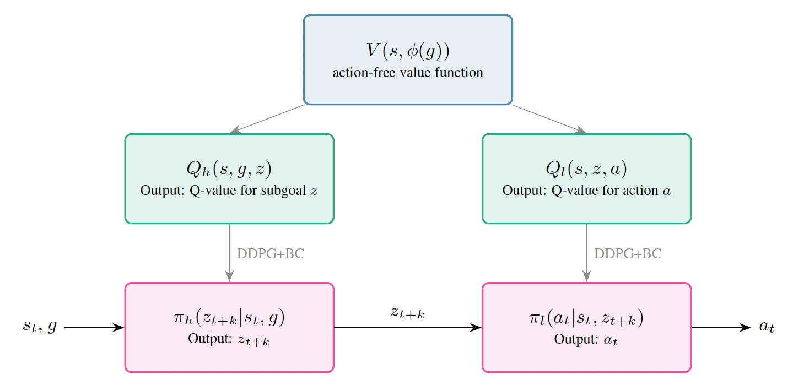

# HIQL-CE: Hierarchical Implicit Q-Learning with Critic Extraction

This repository contains the implementation for "Policy Extraction and Data Efficiency in Hierarchical Implicit Q-Learning," which investigates whether HIQL can be improved by replacing Advantage-Weighted Regression (AWR) with policy gradient methods (DDPG+BC) for policy extraction.



**Key Finding:** The original HIQL substantially outperforms HIQL-CE variants across all tested tasks, revealing that the implicit coupling between value and policy learning in HIQL is crucial for its success.

This is a fork of the [OGBench repository](https://github.com/seohongpark/ogbench) with modifications to support critic extraction experiments.

## Installation

1. **Install OGBench base requirements:**
```bash
pip install ogbench
```

2. **Install training dependencies:**
```bash
cd impls
pip install -r requirements.txt
```

This requires Python 3.9+ and JAX >= 0.4.26.

## Code Structure

All training code is located under the `impls/` directory:

- **`main.py`**: Main training script that orchestrates the entire training pipeline
- **`agents/hiql_ddpgbc_orig.py`**: Core implementation of the `HIQLDDPGBCOGAgent` class with critic extraction
- **`dataset.py`**: Dataset loading and processing, including support for data scaling experiments
- **`agents/hiql.py`**: Original HIQL implementation for reference

The key modification is the `HIQLDDPGBCOGAgent` class, which extends HIQL by:
1. Extracting high-level and low-level critics from the learned V-function
2. Enabling DDPG+BC policy extraction using these critics
3. Supporting both DDPG+BC and AWR policy extraction methods

## Quick Start

### Basic Training

Train HIQL-CE with DDPG+BC on visual-cube-single:

```bash
cd impls
python main.py \
  --env_name=visual-cube-single-play-v0 \
  --train_steps=500000 \
  --eval_episodes=50 \
  --eval_on_cpu=0 \
  --agent=agents/hiql_ddpgbc_orig.py \
  --agent.batch_size=256 \
  --agent.encoder=impala_small \
  --agent.p_aug=0.5 \
  --agent.subgoal_steps=10 \
  --agent.low_actor_rep_grad=True \
  --agent.high_alpha=10.0 \
  --agent.low_alpha=10.0 \
  --agent.actor_loss=ddpgbc
```

### Training with AWR

Replace `--agent.actor_loss=ddpgbc` with `--agent.actor_loss=awr` to use Advantage-Weighted Regression.

## Reproducing Paper Results

### Main Benchmark Results (Table 1)

For each environment, use the optimal alpha values from Table 5 in the paper:

**Visual-Cube (DDPG+BC, α=1):**
```bash
python main.py --env_name=visual-cube-single-play-v0 \
  --agent=agents/hiql_ddpgbc_orig.py --agent.high_alpha=1.0 --agent.low_alpha=1.0 \
  --agent.actor_loss=ddpgbc [... other flags as above]
```

**Visual-Puzzle-3x3 (DDPG+BC, α=1):**
```bash
python main.py --env_name=visual-puzzle-3x3-play-v0 \
  --agent=agents/hiql_ddpgbc_orig.py --agent.high_alpha=1.0 --agent.low_alpha=1.0 \
  --agent.actor_loss=ddpgbc [... other flags as above]
```

**Visual-Puzzle-3x3 (AWR, α=10):**
```bash
python main.py --env_name=visual-puzzle-3x3-play-v0 \
  --agent=agents/hiql_ddpgbc_orig.py --agent.high_alpha=10.0 --agent.low_alpha=10.0 \
  --agent.actor_loss=awr [... other flags as above]
```

### Data Scaling Experiments (Table 2)

The dataset loading mechanism supports separate control over value learning and policy extraction data:

```bash
python main.py --env_name=visual-puzzle-3x3-play-v0 \
  --value_data_transitions=1000000 \
  --policy_data_transitions=100000 \
  --agent=agents/hiql_ddpgbc_orig.py \
  --agent.actor_loss=ddpgbc [... other flags as above]
```

**Data scaling matrix cells:**
- Value data: 100k, 300k, or 1M transitions (`--value_data_transitions`)
- Policy data: 100k, 300k, or 1M transitions (`--policy_data_transitions`)

Run all 9 combinations to reproduce the complete matrix. The dataset loader maintains episode structure when creating subsets.

## Implementation Details

### Critic Extraction Process

The `HIQLDDPGBCOGAgent` implements a three-phase training process:

1. **Value Learning**: Train V(s, g) using action-free IQL (Equation 5 in paper)
2. **Critic Extraction**: Distill explicit Q-functions from V:
   - High-level critic Q_h(s, g, z) for subgoal selection
   - Low-level critic Q_l(s, z, a) for primitive actions
3. **Policy Extraction**: Extract policies using DDPG+BC or AWR objectives

### Key Files

- **Critic learning**: See `critic_loss()` method in `agents/hiql_ddpgbc_orig.py`
- **Policy extraction**: See `actor_loss()` method with `actor_loss` parameter
- **Data scaling**: Modified dataset loading in `dataset.py`

### Evaluation Protocol

- Performance averaged over final 3 evaluation epochs (300k, 400k, 500k steps)
- 50 rollouts per test-time goal per evaluation
- Binary success rate reported across 5 predefined challenging goals per task

## Key Hyperparameters

| Parameter | Value |
|-----------|-------|
| Learning Rate | 3e-4 |
| Batch Size | 256 |
| Discount Factor (γ) | 0.99 |
| IQL Expectile (τ) | 0.7 |
| Subgoal Steps (k) | 10 |
| Image Augmentation | 0.5 (probability) |

**Policy extraction hyperparameters** (α) should be tuned per task - see Table 5 in the paper for optimal values.

## Citation

If you use this code, please cite:

```bibtex
@article{yang2025hiql,
  title={Policy Extraction and Data Efficiency in Hierarchical Implicit Q-Learning},
  author={Yang, Lester},
  year={2025}
}

@inproceedings{park2025ogbench,
  title={OGBench: Benchmarking Offline Goal-Conditioned RL},
  author={Park, Seohong and Frans, Kevin and Eysenbach, Benjamin and Levine, Sergey},
  booktitle={ICLR},
  year={2025}
}
```

## License

This project inherits the MIT license from the original OGBench repository.